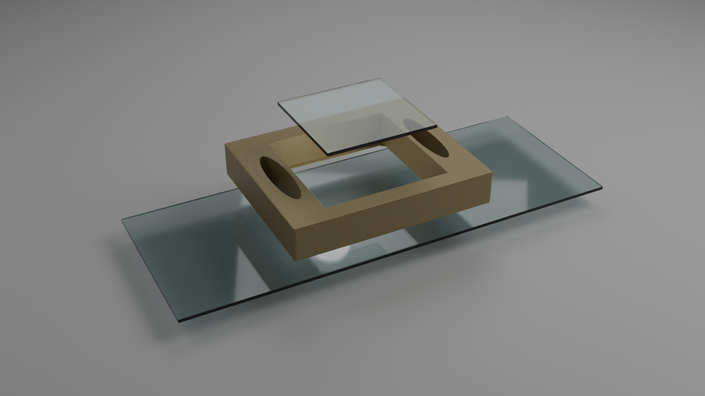

# DoubleBigReservoir Channel Slide

Design your own **flow chambers** and **reservoir slides** for lab experiments!  
This **DoubleBigReservoir** slide combines large reservoirs on both sides with an open channel in the middle — perfect for creating flow chambers with glass coverslips or using as a flexible open chamber for cell culture and solution exchange.

---

## 🔧 General Use

This slide was designed for practical lab workflows and can be 3D printed and assembled easily:

- Two large reservoirs (left and right) make it easy to pipette solutions without disturbing sensitive samples (like cells!).
- The middle channel is **open-bottomed** and includes spacers for placing an **18 mm × 18 mm glass coverslip**.
- A built-in groove runs around the bottom side — perfect for adding glue (e.g., dentist-grade two-component silicone glue) to bond the slide onto a glass slide securely.

---

## ⚡ Quick Start

You can get started in two ways:

### ➤ **Option 1: Use the Pre-made STL File**

1. Download the `DoubleBigReservoir.stl` file.
2. Import the STL into your 3D printer software and print (recommended: PLA on textured PEI plate).

### ➤ **Option 2: Customize in Blender**

1. Download and install [Blender 4.3.2](https://www.blender.org/download/).
2. Download and open the `DoubleBigReservoir.blend` file in Blender.
3. Adjust dimensions or features if desired.
4. Export your customized version as an STL and print.

---

## 🔬 Laboratory Use Tips

This channel slide is *lab-tested* and designed for real-world flexibility!

### 🖨️ Printing & Preparation
- Print on a **textured PEI plate** for best adhesion and a slightly rough surface ideal for glue bonding.
- After printing, use a **silicon-based two-component glue** (like dentist silicone glue) and fill the groove on the bottom of the slide.
- Stick the slide onto a **standard glass slide** (e.g., 24 mm × 50 mm coverslip) and let the glue dry completely.

### 🧫 Assembling a Flow Chamber
1. **First, glue the printed slide onto a glass slide** (e.g., a **24 mm × 50 mm glass coverslip**) using the two-component silicone glue. Make sure to fill the groove at the bottom for a strong, leak-free bond. Let the glue dry completely.
2. Place an **18 mm × 18 mm glass coverslip** on top of the middle spacers (this will form the ceiling of your flow chamber).
3. Gently add liquid into one reservoir — it will flow into the channel and over to the second reservoir.
4. Ensure there is water both *under* the top glass coverslip and *inside* the gap (the middle channel).
5. Seal the top by applying the two-component glue around the coverslip edges and let it dry.  
   ✅ Now you have a sealed flow chamber ready for flushing solutions or experiments!

### 🔄 Flexible Use Modes
- If you want a **large open chamber** (instead of a flow channel):
  - Skip the glass coverslip step and just use the open middle section.
  - Great for adding cell medium with minimal disturbance when pipetting into the reservoirs!
  
- **Bonus trick:** After using the flow chamber, you can *peel off* the two-component glue from the coverslip, remove the coverslip, and convert the slide into an open reservoir chamber! 🌀

---

## 📂 Files Included

- `DoubleBigReservoir.stl` — ready-to-print file.
- `DoubleBigReservoir.blend` — editable Blender file.
- `DoubleBigReservoir.png` — rendered preview image.

All files are located in the [`01-DoubleBigReservoir`](https://github.com/Tobias-Abele/3DModelsLabware/tree/main/ChannelSlides/01-DoubleBigReservoir) folder.

---

## 📜 License

This project is open-source under the [MIT License](LICENSE).  
Feel free to print, modify, and adapt it for your lab needs!

---

## 🧾 Citation

If you use this slide design in your research, feel free to cite it as:

> Abele, T. (2025). *DoubleBigReservoir Channel Slide for Lab Use*. GitHub repository: [https://github.com/Tobias-Abele/3DModelsLabware](https://github.com/Tobias-Abele/3DModelsLabware)

---

## 🙋‍♂️ Contributions

Ideas? Improvements? Cool variations?  
Issues and pull requests are welcome! Let's make labware even better together. 🚀

---
